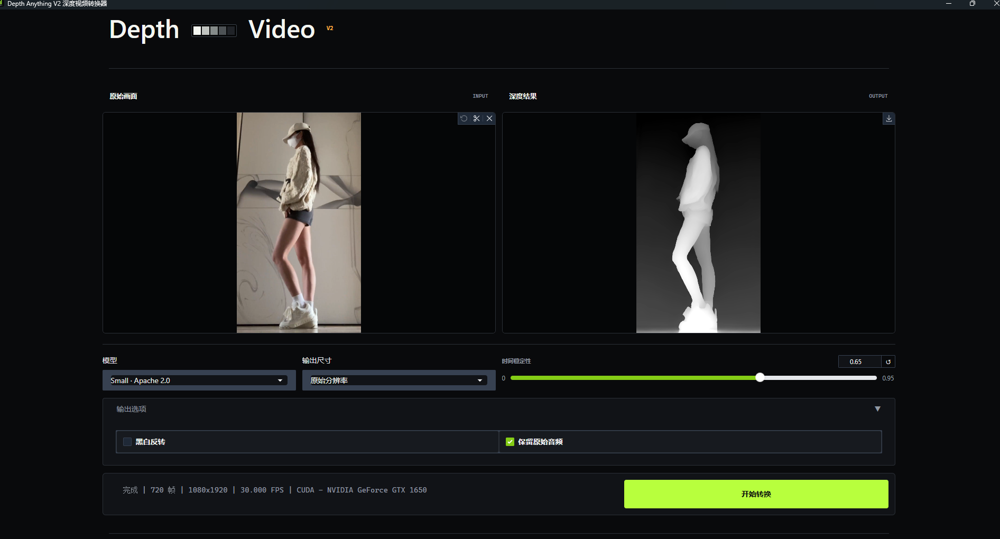

# Depth Anything V2 深度视频转换器

[](https://github.com/chen0610/depth-video/releases/latest)
[](https://github.com/chen0610/depth-video/releases/latest)
[](https://www.python.org/)

一个本地运行的 Depth Anything V2 深度视频转换器。应用逐帧生成灰度相对深度视频，支持 MP4 / MOV、CUDA / MPS 自动加速、时间平滑、音频保留和 H.264 MP4 导出。

[下载最新桌面版](https://github.com/chen0610/depth-video/releases/latest) · [查看源码安装](#源码运行环境) · [联系开发者](mailto:longway1021@gmail.com)



## 功能

- Depth Anything V2 Small / Base / Large 模型选择
- Windows NVIDIA CUDA、macOS Apple Silicon MPS 自动选择，不可用时回退到 CPU
- 原始分辨率、480p、720p、1080p 输出，保持画面比例
- 黑白反转
- 基于稳定分位范围和逐像素 EMA 的时间平滑
- 自动检测镜头切换，减少平滑导致的跨镜头残影
- 可选保留原始音频，转码为 AAC
- `imageio-ffmpeg` 随 Python wheel 提供 ffmpeg，普通安装无需单独配置 ffmpeg

## 下载桌面版

### Windows 10 / 11 x64

前往 [最新 Release](https://github.com/chen0610/depth-video/releases/latest)，下载下面三个文件并放在同一目录：

1. [`DepthVideo-Windows-x64.zip.001`](https://github.com/chen0610/depth-video/releases/latest/download/DepthVideo-Windows-x64.zip.001)
2. [`DepthVideo-Windows-x64.zip.002`](https://github.com/chen0610/depth-video/releases/latest/download/DepthVideo-Windows-x64.zip.002)
3. [`Assemble-DepthVideo-Windows.cmd`](https://github.com/chen0610/depth-video/releases/latest/download/Assemble-DepthVideo-Windows.cmd)

双击 `Assemble-DepthVideo-Windows.cmd`。脚本会合并分卷并自动校验 SHA-256，得到 `DepthVideo-Windows-x64.zip`。解压后进入 `DepthVideo` 目录，双击 `DepthVideo.exe` 即可启动。

Windows 便携包已包含 Python、CUDA 版 PyTorch、Gradio、ffmpeg、WebView 宿主和 Small 模型，不需要安装 Python 或 CUDA Toolkit。支持 NVIDIA CUDA 自动加速；CUDA 不可用时自动回退到 CPU。压缩包约 2.88 GB，解压后约 4.3 GB，主要空间来自 PyTorch CUDA 与 cuDNN 动态库。

GitHub 要求每个 Release 附件小于 2 GiB，因此 Windows 包必须分成两个附件；Release 的总附件大小没有这一限制。详见 [GitHub 官方说明](https://docs.github.com/en/repositories/releasing-projects-on-github/about-releases#storage-and-bandwidth-quotas)。

当前 Windows 版本未进行代码签名，SmartScreen 可能显示“Windows 已保护你的电脑”。请先确认文件来自本仓库的 Release，并通过合并脚本的 SHA-256 校验，再决定是否运行。

默认构建内置 Small 权重，可离线开始转换。Base 和 Large 权重不内置，首次选择时仍需联网下载。

### macOS

当前 Release 暂未提供预编译的 macOS `.app`。macOS 用户可按下方命令从源码运行，或在自己的 Mac 上执行 `build_macos.sh` 构建。公开分发的 macOS 应用仍需要开发者证书签名和 Apple notarization，不能在 Windows 上可靠生成。

桌面版的模型与日志保存在用户数据目录：

- Windows：`%LOCALAPPDATA%\Longway\Depth Video`
- macOS：`~/Library/Application Support/Longway/Depth Video`

Windows 10/11 通常已安装 Microsoft Edge WebView2 Runtime。若精简系统移除了该组件，需要从微软官方安装 WebView2 Runtime；这不是 Python 环境依赖。

## 构建桌面版

PyInstaller 不是跨平台编译器。Windows 应用必须在 Windows 构建，macOS `.app` 必须在 macOS 构建。

`dist/` 是开发者本地构建目录，已通过 `.gitignore` 排除，不会出现在克隆后的仓库中。面向用户的可下载二进制统一发布在 [GitHub Releases](https://github.com/chen0610/depth-video/releases)。

Windows PowerShell：

```powershell
Set-ExecutionPolicy -Scope Process Bypass
.\build_windows.ps1
```

默认会安装 `requirements-desktop.txt`、生成图标、准备 Small 模型并输出 `dist\DepthVideo\DepthVideo.exe`。已有依赖时可使用 `-SkipInstall`；不内置 Small 模型时使用 `-WithoutBundledSmallModel`；需要便携压缩包时追加 `-Zip`。

macOS：

```bash
chmod +x build_macos.sh
./build_macos.sh
```

输出为 `dist/Depth Video.app` 和 `dist/DepthVideo-macOS.zip`。通过环境变量 `WITHOUT_BUNDLED_SMALL_MODEL=1` 可跳过内置模型；配置 `CODESIGN_IDENTITY` 后脚本会执行本地代码签名。面向其他用户公开分发时，Windows 和 macOS 产物都应使用开发者证书签名；macOS 还应完成 Apple notarization，当前脚本不代替证书申请和公证提交。

## 源码运行环境

- Python 3.10 - 3.12（推荐 Python 3.11）
- Windows 10/11，或 macOS 14+
- 首次选择模型时需联网下载 Hugging Face 权重，缓存位于项目的 `.cache/huggingface`
- 磁盘空间取决于模型：Small 约 100 MB，Base 约 400 MB，Large 约 1.4 GB

## Windows 安装

在 PowerShell 中进入项目目录：

```powershell
py -3.11 -m venv .venv
Set-ExecutionPolicy -Scope Process Bypass
.\.venv\Scripts\Activate.ps1
python -m pip install --upgrade pip
```

NVIDIA 驱动 525 - 579（CUDA 12.6 wheel）：

```powershell
python -m pip install torch torchvision --index-url https://download.pytorch.org/whl/cu126
python -m pip install -r requirements.txt
```

NVIDIA 驱动 580 或更高（CUDA 13.0 wheel）：

```powershell
python -m pip install torch torchvision --index-url https://download.pytorch.org/whl/cu130
python -m pip install -r requirements.txt
```

仅 CPU：

```powershell
python -m pip install torch torchvision --index-url https://download.pytorch.org/whl/cpu
python -m pip install -r requirements.txt
```

启动：

```powershell
python app.py --inbrowser
```

## macOS 安装

Apple Silicon 与 Intel Mac 使用同一套命令；Apple Silicon 在 MPS 可用时会自动启用 GPU，Intel Mac 回退到 CPU。

```bash
python3.11 -m venv .venv
source .venv/bin/activate
python -m pip install --upgrade pip
python -m pip install torch torchvision
python -m pip install -r requirements.txt
python app.py --inbrowser
```

默认地址为 <http://127.0.0.1:7860>。若端口被占用：

```bash
python app.py --port 7861
```

## 加速状态检查

Windows CUDA：

```powershell
python -c "import torch; print(torch.cuda.is_available(), torch.version.cuda); print(torch.cuda.get_device_name(0) if torch.cuda.is_available() else 'CPU')"
```

macOS MPS：

```bash
python -c "import torch; print(torch.backends.mps.is_available())"
```

界面底部的“状态”会显示实际选中的设备。应用不自行安装 CUDA；是否能启用 CUDA 取决于 NVIDIA 驱动和当前虚拟环境中的 PyTorch wheel。

## 使用

1. 上传 `.mp4` 或 `.mov` 视频。
2. 选择模型、分辨率和时间平滑强度。
3. 根据需要开启黑白反转或关闭音频保留。
4. 点击“开始转换”，完成后在右侧预览或下载 MP4。

480p / 720p / 1080p 代表将输出的短边设为对应像素数，长边按原始比例计算。因此竖屏 1080p 视频通常为 1080x1920。

## 模型与许可

| 模型 | 参数量 | 权重许可 | 建议用途 |
| --- | ---: | --- | --- |
| Small | 24.8M | Apache-2.0 | 默认、商业用途、较小显存 |
| Base | 97.5M | CC-BY-NC-4.0 | 非商业、更高质量 |
| Large | 335.3M | CC-BY-NC-4.0 | 非商业、高显存设备 |

源代码的 Apache-2.0 许可不会改变 Base / Large 模型权重的非商业限制。用于商业场景时应选择 Small，并自行确认输入视频和输出内容的权利。

## 实现边界

- 输出是单目相对深度，不是米、毫米等真实距离。
- 默认是近处较亮、远处较暗；“黑白反转”可切换显示方向。
- 时间平滑越强，静态画面闪烁越少，但快速运动边缘可能产生短暂残影。
- 变帧率输入会按 ffmpeg 解析的平均帧率输出为恒定帧率。
- HDR 和特殊色彩管理信息不会保留；输出是 8-bit yuv420p。
- 同一时间只运行一个转换任务，以避免多任务竞争 GPU 显存。

## 复杂度

对于 `F` 帧、输出分辨率 `W x H` 的视频：

- 时间复杂度为 `O(F * (M + W*H))`，其中 `M` 是选定模型单帧推理代价。
- 视频帧使用流式读写，额外内存为 `O(W*H)`；总内存主要由模型权重、中间特征和两张深度帧占用。

## 开发者

本工具由 **Longway** 开发和维护。

联系邮箱：[longway1021@gmail.com](mailto:longway1021@gmail.com)

## 官方资料

- [Depth Anything V2 官方仓库](https://github.com/DepthAnything/Depth-Anything-V2)
- [Transformers: Depth Anything V2](https://huggingface.co/docs/transformers/model_doc/depth_anything_v2)
- [PyTorch 本地安装](https://pytorch.org/get-started/locally/)
- [PyTorch MPS 后端](https://docs.pytorch.org/docs/stable/notes/mps.html)
- [Gradio Video 组件](https://www.gradio.app/docs/gradio/video)
